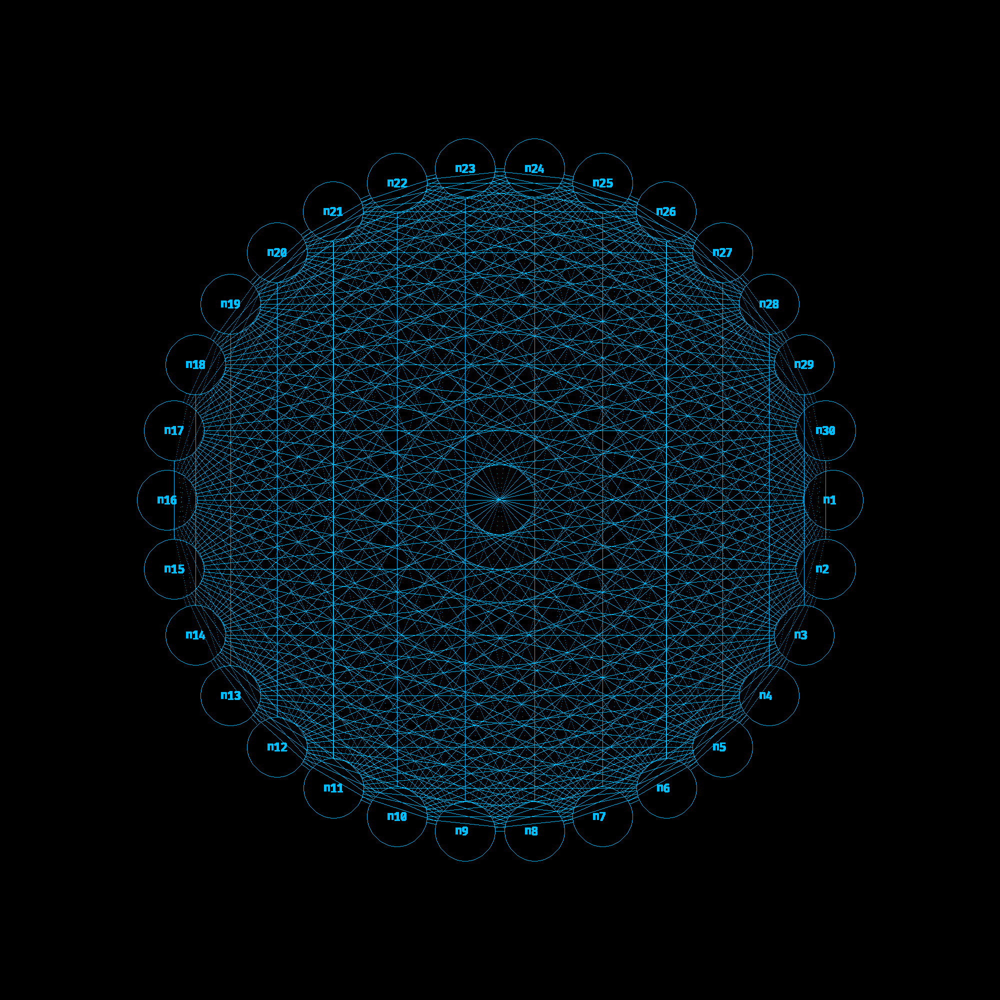

# :star2: Erd&#x0151;s-R&#x00E9;nyi Model (RGT) Visualized
This program uses the Erd&#x0151;s-R&#x00E9;nyi Model of random graphs to
produce visual graphs for the user to analyze. Additionally with some tweaks it
can virtualize the method and take statistics over the virtualization.



It does this by producing [netpbm files](https://en.wikipedia.org/wiki/Netpbm).
For more information on netpbm files and my recomendations on using them see the
`Running` section below.

# :hammer: Building
This program relies on:
  - gcc
  - GNUMake
  - [FreeType C library](https://freetype.org/)

These can be installed from any Debian based distro (or any distro with apt on
it) via:
```
sudo apt update && sudo apt upgrade
sudo apt install gcc make libfreetype6
```
A small node, as I devlope on NixOS, you will notice a nix script in this repo,
to be able to compile the program (assuming that you have `gcc` and `make` in
your environment) you should run:
```
nix-shell ./nix/shell.nix
```
This will make a shell session for which the FreeType library is installed.

Additionally you will need a font file in `.ttf` format. For my examples I used
[FiraCode-Bold font](https://github.com/tonsky/FiraCode/releases). In order for
my program to work with the default parameters, you will need to get the
release, then unzip/untar it and from the source root:
```
mkdir fonts/
cp path/to/FiraCode-Bold.ttf fonts/
```
My program is agnostic of font but it needs to be changed in the configuration
file (see `Running` below).

Once you have ensured that these programs are installed, run the following:
```
mkdir bin/
make
```
This will build the program, into a binary called `main` in the directory
`bin/`. To test it, you can run:
```
make run
```
This will write a visualization of the simulation with the defaults (see
`Running` below).

# :runner: Running
This program can modify parameters via a configuration file which can be fed to
the binary as command line options. If you want to test the example
configurations you can run:
```
make run-configs
```
This will run the simulations on the example configs and will output three
`.ppm` files (test1.ppm, test2.ppm, test3.ppm) in the current directory.

Let's take a look at an example config:
```
NODE_COLOR   0,190,255
CANVAS_COLOR 0,10,11
FONT_SIZE    60
PATH_TO_FONT "fonts/FiraCode-Bold.ttf"
CANVAS_DIMS  1000
GNM          15, 15
OUT_FILE     "test1.ppm"
```
These parameters are pretty self explanitory, you can use single or double
quotes for the file names. Also note that any `.ttf` font file can be used, just
specify the correct path from where you are running the binary.

## A Not For .ppm
There are two options for getting around this:
 - Get an image viewer to view the `.ppm` file.
 - Get a converion tool to convert to .png.
### Image view
I recommend feh. For distros with apt:
```
sudo apt update && sudo apt upgrade
sudo apt install feh
feh name_of_file.ppm
```
### Image converter
I recommend ImageMagick. For distros with apt:
```
sudo apt update && sudo apt upgrade
sudo apt install ImageMagick
convert name_of_file.ppm name_of_file.png
```

# :thought_balloon: Theory

My program simulates the
[Erd&#x0151;s-R&#x00E9;nyi Model](https://en.wikipedia.org/wiki/Erd%C5%91s%E2%80%93R%C3%A9nyi_model)
and puts it into an image format of the simulation. It can do the GNP or GNM
variations of the simulation.

## Run Time of Inscribing Geometric Figures
This program uses Bresenham's algorithms for drawing circles and lines to ensure
that my program doesn't take forever to run (also it uses no floating point
arithmetic to do this).
